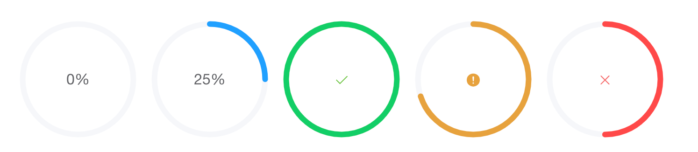
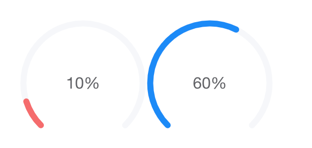

# Компоненты с круговым прогресс баром и круговой диаграммой

Задача 1

Реализовать на Vue 3 (composition api) без использования сторонних библиотек компонент кругового прогресс бара. В реализации использовать SVG, не canvas. Реализация и через svg и через canvas будет плюсом, но обязательная программа - SVG.

Прогрессбар имеет 4 состояния - in progress, success, warning, error.
При изменении значения прогресс бара анимация увеличения должна быть плавной. Изменения статуса так же должно быть плавным.
По мере увеличения значения прогресс бара цвет заполненного сектора окружности меняется от красного к зеленому.
Компонент должен быть полноценным, готовым к использованию в проекте. Подготовить страницу с демонстрацией возможностей компонента.

Так же должна быть возможность изменить тип прогресс бара на dashboard, в таком случае он должен изменить форму на следующую:

Задача 2
Делать в том же проекте, отдельная страница, так же vue, так же composition api.
Реализовать круговую диаграмму используя библиотеку chartjs. Так же реализовать форму, состоящую из полей: наименование, значение, цвет. Для выбора цвета использовать color picker из какой-нибудь сторонней библиотеки, например https://www.npmjs.com/package/vue-colour-picker
При добавлении элемента через форму добавлять его в pie chart. Элементы должно быть можно удалять и редактировать. Реализовать в соответствии с дизайном https://www.figma.com/design/wlwVRFgUH1BYsAOKgylnzY/Untitled?node-id=0-1&t=a2W3WL18kEtD7ZI3-1
В отношении color picker строгое соответствие дизайна не требуется, главное чтобы цвет выбирался.
